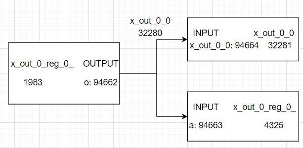

## July 26 Wed, 2023

00:14

1. 在 DreamPlace 中添加一个模块`mytest.cpp`，运行该模块即可得到解析文件后的 PlaceDB，跳过 python 的接口部分，方便后续调试。通过对该模块进行调试即可读取 PlaceDB 运行时的信息，从而理解 PlaceDB 数据结构，用于编写计算数据流的代码。
2. 过程中解决了各种库和头文件的链接问题，修改了原有的 CMakeList.txt，用于生成新添加模块的可执行文件。
3. 目前新加模块已经可以正常运行，并通过断点调试读出 PlaceDB 的运行时信息。

## July 28 Fri, 2023

00:06

1. 构建自己的数据结构，命名中均以`d`开头，表示 dataflow 的含义。
2. 构建`dNode`，包含`isMacro`用于判断是 cell 还是 macro。
3. 构建`dPathNode`，用于记录路径上的节点信息，包含一条边的起始节点、终止节点、起始引脚、终止引脚、所使用的 net。
4. 构建`dPath`，记录路径。
5. 构建`dDataflowCaler`，代表计算数据流的功能，`dNodeInit`从 PlaceDB 中初始化所有`dNode`，`DFS`根据深度优先遍历，计算从一个宏出发，到其他宏的路径，`computeMacro2MacroPath`是计算路径的入口，`computeMacro2MacroDataflow`根据计算出的路径，统计 macro 两两之间的数据流的值，`compute`是计算数据流的总入口，将以上函数进行了组合。

## August 22 Tue, 2023

23:22

TODO:

-   [x] ispd 2005 和 ispd 2015 判断节点是否是 macro 的方式不同，需要修改。
-   [x] 是否可以根据 node 名称中是否存在 reg 判断 node 是否是寄存器？ 待确认
-   [x] m_vNode 中是否包含 m_vMacro 中的点
-   [x] m_vMacro 的引脚如何处理

## August 23 Wed, 2023

23:44

1. 总共有 3 类元件，cell, macro, iopin，其中 cell 包含 register 和组合元件，这三类元件都需要抽象成同一个数据结构 dNode
2. DreamPlace 中的 macro 数组同时存储了 macro 和 iopin
3. DreamPlace 中的 node 数组同时存储了 cell 和 iopin
4. 所以 macro 和 cell 不具有相同的数据结构，需要分别进行处理
5. macro 的引脚需要单独处理，这个是重点
6. 完成了寄存器的判断
7. 目前的代码实现中，错误的认为 DreamPlace 的 node 数组存储了 macro，相应的逻辑是错误的

TODO

-   [x] 抽象 macro 为 dNode
-   [x] 处理 macro 的引脚

## August 24 Thu, 2023

1. 完成 macro 到 dNode 的抽象，重新定义了 dNode 成员变量，只保留计算数据流所必须的内容，从而无论输入是 cell 还是 macro，计算出这些成员变量的值即可实现统一的抽象
2. 无法从 macro 的引脚找到所连接的 net，特别追踪了`ms00f80 x_out_0_reg_0_ (.ck(ispd_clk), .d(n_7222), .o(x_out_0_0));`语句中各元件的连接结构。其中 `net x_out_0_0` 的连接结构如下
   
   其中 `net x_out_0_0` 在 PlaceDB 中只连接了 3 个 pin，全部在图中，并没有连接到 `macro ms00f80` 的部分。目前推测 `x_out_0_reg_0_` 是 `macro ms00f80` 的一个实例？那哪些是 cell，哪些是 macro？

TODO

-   [ ] 确认语法含义
-   [ ] 了解 cells.lef, floorplan.def, design.v, tech.def 的内容含义和作用。目前的理解是
    -   cells.lef: 定义了各 macro
    -   floorplan.def: 描述了基板上每行的属性
    -   design.v: 描述 cell 和 net 之间的连接关系
    -   tech.def: 描述了基板上各部分的属性
-   [ ] 考虑如何接入 ChipFormer

## September 06 Wed, 2023
1. 发现计算 datamask 时，x, y方向设置错了，与pl文件的方向不一致
2. 找到可视化代码 bug，变量赋值出现错误
3. datamask 代码可能仍存在问题，可视化结果可以看到存在重叠的情况，预期中这不应该出现

## September 11 Mon, 2023
1. 完成可视化效果中数据流连线的绘制
2. 将数据流指标添加到macro排序中，目前采用面积和数据流加权平均的方式，在加权平均前，对两个指标都进行了归一化$\frac{x-\bar{x}}{\sigma}$，$area$的权重是$\alpha$，$dataflow$的权重是$\beta$。
3. 尝试了不同加权平均的比例参数，目前观察的结果是对$\alpha$在$0.05~0.6$之间非常不敏感，布局结果几乎没有区别，在$0~0.05$和$0.6~0.8$之间变化较大。目前推测是个别权重改动导致对布局结果影响较大的元件的放置顺序发生了变化，导致布局结果差异较大。
4. 后续需要修改为考虑上一轮结果的迭代方式，这应该可以消除一些对参数的不稳定性
5. 思源提到的 datamask 的布局结果的 dataflow loss 比 wiremask 大的问题，在$\alpha=0,\beta=1$的情况下，datamask布局结果的$dataflow\ loss$反而大于$\alpha=0.5,\beta=0.5$的情况。这说明希望$dataflow$得到最优布局的macro放置顺序需要考虑area，并且权重可能不小。另外，4 中的修改也可能可以解决这个问题。

## September 27 Wed, 2023
- [x] 读取 .nodes 文件，存储 width, height 信息
- [x] 读取 .pl 文件，存储 bottom_left_x, bottom_left_y 信息
- [x] 根据是否是 macro，采取不同的绘制方式

## October 13 Fri, 2023
1. 统一采用随机布局，由于随机布局中的 port 的位置并没有明确的意义，所以恢复为不区分macro和port的方案

## October 31 Tue, 2023
1. EA调优函数现在是hpwl, dataflow, regularity的加权平均，但是这三者的量级差距很大，比如
   `'value': 53286642039.95, 'hpwl': 1474387.0, 'dataflow': 96301.5, 'regularity': 266429379780.0`，可能需要进行类似归一化的操作，具体应该怎么做？
2. EA扰动几乎都无用，只有极少数在迭代刚开始前 1-3 次扰动有效，大多数第一次扰动就无效。
3. detailed placement时，注意删除需要删除的port